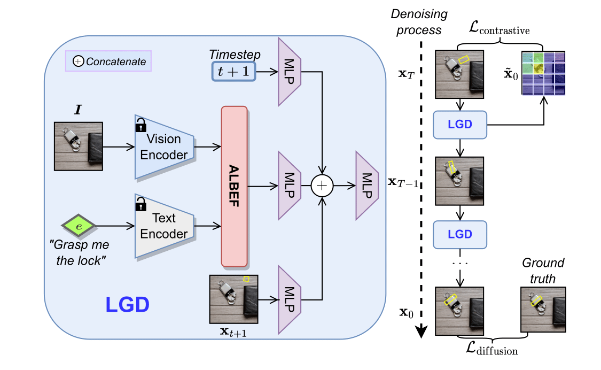
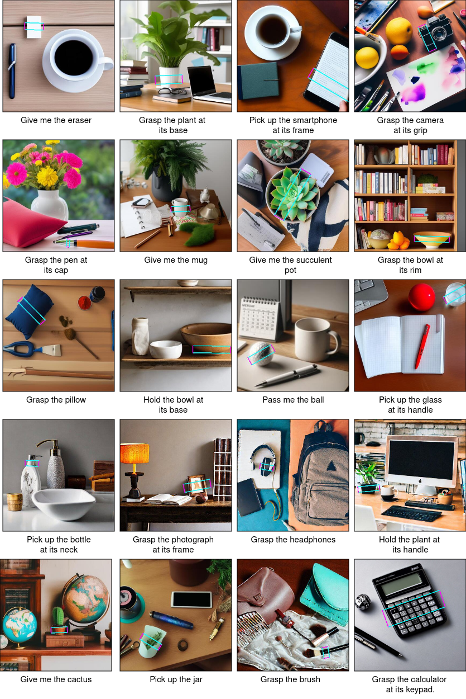

Grasp-Anything++ revolutionizes grasp detection with a dataset featuring **1 million samples**, **3 million objects**, and over **10 million language-based instructions**. Utilizing foundation models for a vast scene description corpus, our work introduces a language-centric detection method via diffusion models, enhanced by a contrastive training objective.

## Method

  

Our network operates under two conditions: an image labeled as *I* and a related text prompt indicated by *e*. Through the ALBEF module [Li et al., 2021], we integrate embeddings from both text and image. The attention mask produced by ALBEF serves as our estimate, and we apply a contrastive loss `L_contrastive` to this mask against the noisy grasp pose `x_T`. We generate the denoised grasp pose by passing ALBEF's features through MLP layers, yielding a diffusion loss `L_diffusion`. The overall training goal combines these losses into `L_total = L_contrastive + L_diffusion`.

## Demonstration
<video width="100%" controls>
  <source src="../assets/images/CVPR24_demo.mp4" type="video/mp4">
  Your browser does not support the video tag.
</video>

## Samples
Here are some samples from the Grasp-Anything++ dataset. Above are the corresponding grasp instructions.

  

## References
[1] Li, J., Selvaraju, R., Gotmare, A., Joty, S., Xiong, C., & Hoi, S. C. H. (2021). Align before fuse: Vision and language representation learning with momentum distillation. Advances in neural information processing systems, 34, 9694-9705.
